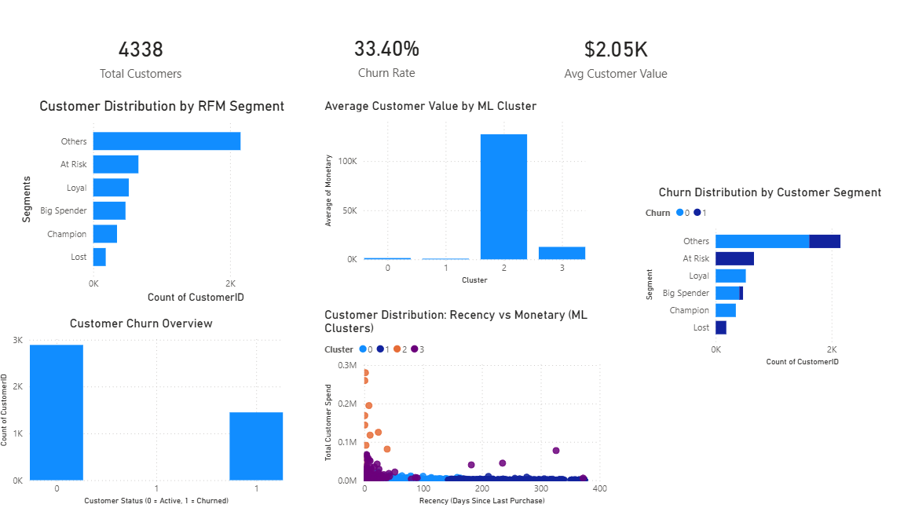

# E-Commerce Customer Analytics & Churn Prediction

## Project Overview
This project analyzes e-commerce customer transaction data using RFM (Recency, Frequency, Monetary) analysis and machine learning techniques to identify valuable customers and predict churn risk.

## Key Features
- Customer segmentation using RFM metrics
- Churn prediction using ML models
- Data preprocessing and feature engineering
- Power BI dashboard visualization
- Business insights for customer retention

## Tools & Technologies
- Python (Pandas, NumPy, Scikit-learn)
- Jupyter Notebook
- Power BI
- Machine Learning Techniques

## Dataset
Online retail transactional dataset used for customer behavior analysis.

## Dashboard Preview

## Author
Nishika Gangwani
